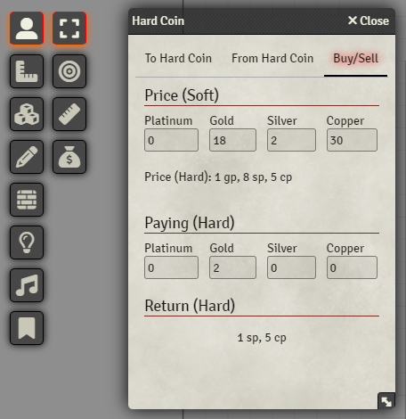

[Discord](https://discord.gg/VMqndcyUGS)

# Introduction
Another module designed for in-person games. If you are a DM who loves physical props like coins to hand out to your players, then this module is for you!
Physical coins are fun and all, but soon you'll realize that it is not feasible to have a 1:1 ratio, so you probably decided to give your players one gold coin for each in-game gold. But math is hard, especially when dealing with splitting the money, buying and selling.
This module provides you with a handy converter between hard (physical) and soft (in-game) coins.

### Usage
You'll find a new icon (Money bag) in the token sub-menu. When clicked, it opens a new window. Here you can:
* Convert from hard to soft coin and split it amongst a number of players
* Convert from soft to hard coin
* Calculate how much hard coin an item costs, including the calculation of the change the player gets back

### Settings
* The default ratio between hard and soft coin is 1:10, but you can change that in the settings.

### Notes
* Since I only use copper, silver, and gold (hard) coins, the converter does not convert to platinum, and electrum does not even exist.
* Since this is just a side project, I am not planning to extend it much further

### Support
If you like to support my work find me on [Patreon](https://www.patreon.com/SyriousWorkshop).
